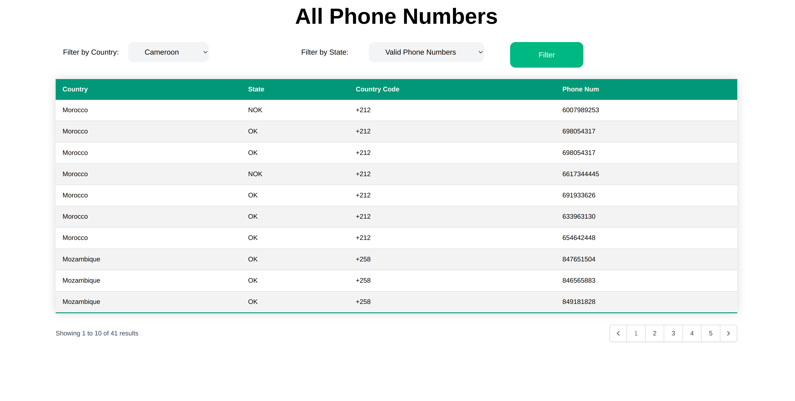

# Phone Numbers Task
This project is a Single Page Application that lists phone numbers from a sample database and filters by country and if it is valid or not.

Phone numbers should be categorized by country, state (valid or not valid), country code and number.

The page should render a list of all phone numbers available in the DB. It should be possible to filter by country and state.
<p align="center">

</p>

## Features
- Using chain of responsibility Pattern.

## Installation
- On the folder 'Phone-numbers/app/' run the following code:
```sh
$ composer install
```

## Regular expressions to validate the numbers:

1. Cameroon | Country code = +237 | regex = \(237\)\ ?[2368]\d{7,8}$
2. Ethiopia | Country code = +251 | regex = \(251\)\ ?[1-59]\d{8}$
3. Morocco | Country code = +212 | regex = \(212\)\ ?[5-9]\d{8}$
4. Mozambique | Country code = +258 | regex = \(258\)\ ?[28]\d{7,8}$
5. Uganda | Country code = +256 | regex = \(256\)\ ?\d{9}$

## Requirements
- Php 8.1.2
- Composer
- Sqlite 3
- Tailwind Css
